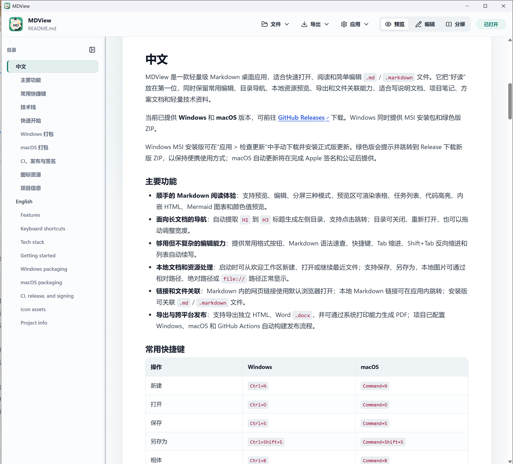

<div align="center">
  
  <h1>MDView</h1>
  <p><strong>Read Markdown. Stay focused.</strong></p>
  <p>轻量、清晰、跨平台的 Markdown 阅读与编辑工具</p>

  <p>
    <a href="https://github.com/isunky/MDView/releases/latest"></a>
    <a href="https://github.com/isunky/MDView/actions/workflows/ci.yml"></a>
    <a href="LICENSE"></a>
    
  </p>

  <p>
    <a href="https://github.com/isunky/MDView/releases/latest"><strong>下载 / Download</strong></a>
    · <a href="#中文">中文</a>
    · <a href="#english">English</a>
    · <a href="#开发--development">Development</a>
  </p>

  <p>
    <strong>Version / 版本：</strong>3.0.0
    · <a href="https://www.sunky.net">Sunky</a>
  </p>
</div>

## 界面预览 / Interface Preview

<table>
  <tr>
    <td width="50%" align="center"><strong>阅读工作区 / Reading workspace</strong></td>
    <td width="50%" align="center"><strong>欢迎页 / Welcome screen</strong></td>
  </tr>
  <tr>
    <td width="50%" valign="top">
      <a href="main2.png">
        
      </a>
    </td>
    <td width="50%" valign="top">
      <a href="main.png">
        
      </a>
    </td>
  </tr>
  <tr>
    <td align="center">
      <sub>目录导航、沉浸预览与长文档阅读<br />Outline navigation, focused preview, and long-document reading</sub>
    </td>
    <td align="center">
      <sub>快速打开、新建和继续最近文档<br />Open, create, or continue recent documents</sub>
    </td>
  </tr>
</table>

<p align="center"><sub>点击截图查看原图 · Click either screenshot to view it at full size.</sub></p>

## 中文

MDView 是一款面向本地 Markdown 文档的轻量桌面应用。它把阅读体验放在首位，同时提供编辑、目录导航、导出和文件关联等常用能力。

- **清晰预览**：支持 GFM 表格、任务列表、代码高亮、Mermaid、LaTeX 数学公式、内嵌 HTML 和颜色预览。
- **三种视图**：在预览、编辑和分屏模式之间快速切换。
- **长文档导航**：自动提取 `H1` 至 `H4` 生成目录，可切换展示层级、跟随当前阅读位置，并按文件恢复阅读现场。
- **阅读主题与排版**：支持浅色、深色和跟随系统；可调整正文的字体、字号、行高和内容宽度，代码高亮会随主题自动切换。
- **本地文件体验**：支持最近文件、相对路径图片和本地 Markdown 链接；可从工具栏批量选择、粘贴或拖入图片，自动保存到同级 `assets` 目录，并显示导入进度和失败重试入口。
- **实用编辑能力**：提供撤销重做、公式编辑面板、快速表格、H1-H4 标题、代码块、查找替换、语法速查、列表续写和实时编辑状态栏。
- **灵活导出**：可导出独立 HTML、Word `.docx`，也可通过系统打印生成 PDF；公式会保留在 HTML/PDF 中，常用公式在 Word 中保持原生可编辑。

## English

MDView is a lightweight desktop app for local Markdown documents. It prioritizes a calm reading experience while keeping practical editing, navigation, export, and file-association tools close at hand.

- **Clean preview**: GFM tables, task lists, syntax highlighting, Mermaid, LaTeX math, inline HTML, and color swatches.
- **Three views**: switch quickly between Preview, Edit, and Split modes.
- **Long-document navigation**: generate an outline from `H1` to `H4`, choose the visible depth, follow the current reading position, and restore each file's reading state.
- **Reading theme and typography**: choose light, dark, or system appearance; tune body font, size, line height, and content width, with code highlighting following the active theme.
- **Local-first workflow**: recent files, relative images, local Markdown links, and `.md` / `.markdown` associations; select multiple images from the toolbar, paste, or drag them into a sibling `assets` folder with progress and retry support.
- **Practical editing**: undo and redo, a live formula editor, quick GFM tables, H1-H4 headings, code blocks, find and replace, syntax reference, list continuation, and a live document status bar.
- **Flexible export**: export standalone HTML or Word `.docx`, and create PDF files through system printing; formulas remain visible in HTML/PDF and common formulas stay editable in Word.

### 数学公式 / Math formulas

行内公式使用 `$...$`，独立公式块使用单独成行的 `$$`。编辑模式可点击 `Σ` 打开公式面板，通过模板、LaTeX 输入和实时预览快速插入或修改公式。需要原样显示美元符号时请写为 `\$`。

Use `$...$` for inline math and `$$` on separate lines for display math. In Edit mode, click `Σ` to insert or update a formula with templates and a live LaTeX preview. Escape a literal dollar sign as `\$`.

## 下载 / Download

从 [GitHub Releases](https://github.com/isunky/MDView/releases/latest) 获取最新版本。
Get the latest build from [GitHub Releases](https://github.com/isunky/MDView/releases/latest).

| 平台 / Platform | 包 / Package | 说明 / Notes |
| --- | --- | --- |
| Windows | Bilingual offline setup | 推荐；按系统语言自动使用中文或英文界面，完整离线安装 / Recommended; automatically selects Chinese or English and installs fully offline |
| Windows | MSI | 提供英文和简体中文独立包，支持文件关联和应用内更新 / Separate English and Simplified Chinese packages with file associations and in-app updates |
| Windows | Portable ZIP | 解压即用，不写入文件关联 / Extract and run; no file associations |
| macOS | Universal DMG | macOS 10.15 或更高版本；ad-hoc 签名 / macOS 10.15 or later; ad-hoc signed |
| Microsoft Edge | Extension ZIP | 在 `edge://extensions` 打开开发人员模式后选择“加载解压缩的扩展”，或使用 CI 产物 ZIP 提交 Edge Add-ons / Load unpacked from `dist-edge`, or submit the CI ZIP to Edge Add-ons |

Windows MSI 安装时可选择是否关联 `.md` 和 `.markdown`，默认开启。静默部署可传入 `ASSOCIATE_MARKDOWN_FILES=0` 禁用关联：

```powershell
msiexec /i MDView_x64.msi ASSOCIATE_MARKDOWN_FILES=0 /qn
```

The Windows MSI lets you opt out of `.md` and `.markdown` associations, which are enabled by default. For unattended deployment, pass `ASSOCIATE_MARKDOWN_FILES=0` as shown above.

双语离线安装程序只内嵌一份 MSI 和中文语言转换文件，因此体积接近单个 MSI；中文 Windows 自动显示中文界面，其他系统默认显示英文界面。

The bilingual offline setup embeds one MSI plus a compact Chinese language transform, so its size remains close to a single MSI. Chinese Windows installations use Chinese automatically; other systems default to English.

> 从首个 SignPath 审批后的发布版本开始，Windows MSI 与 Portable ZIP 中的 `MDView.exe` 会进行 Authenticode 签名。历史版本、本地构建和未完成审批的构建仍可能未签名；新签名版本也需要逐步建立 SmartScreen 声誉。
> Starting with the first SignPath-approved release, the Windows MSI and `MDView.exe` in the Portable ZIP are Authenticode-signed. Historical, local, and not-yet-approved builds may remain unsigned; newly signed versions also need time to establish SmartScreen reputation.

> macOS Universal DMG 使用 ad-hoc 签名，避免 GitHub 下载后被 macOS 判定为“已损坏”。由于尚未完成 Apple 公证，首次启动仍可能需要右键点击应用并选择“打开”，或前往“隐私与安全性”允许。请始终直接从 GitHub Release 下载 DMG，不要转发解压后的 `.app`。
> The macOS Universal DMG is ad-hoc signed so macOS does not treat a GitHub download as damaged. It is not yet Apple-notarized, so first launch may require right-clicking the app and choosing Open, or approving it in Privacy & Security. Always download the DMG directly from GitHub Releases and do not redistribute an extracted `.app`.

签名政策与发布审批流程见 [CODE_SIGNING_POLICY.md](CODE_SIGNING_POLICY.md)。
See [CODE_SIGNING_POLICY.md](CODE_SIGNING_POLICY.md) for the signing policy and release approval process.

## 快捷键 / Shortcuts

| 操作 / Action | Windows | macOS |
| --- | --- | --- |
| 新建 / New | `Ctrl+N` | `Command+N` |
| 打开 / Open | `Ctrl+O` | `Command+O` |
| 保存 / Save | `Ctrl+S` | `Command+S` |
| 另存为 / Save As | `Ctrl+Shift+S` | `Command+Shift+S` |
| 查找 / Find | `Ctrl+F` | `Command+F` |
| 撤销 / Undo | `Ctrl+Z` | `Command+Z` |
| 重做 / Redo | `Ctrl+Y` 或 `Ctrl+Shift+Z` | `Command+Shift+Z` |
| 粗体 / Bold | `Ctrl+B` | `Command+B` |
| 斜体 / Italic | `Ctrl+I` | `Command+I` |
| 插入链接 / Insert link | `Ctrl+K` | `Command+K` |
| 缩进 / 反向缩进 | `Tab` / `Shift+Tab` | `Tab` / `Shift+Tab` |

## 开发 / Development

需要 Node.js、Rust/Cargo，以及对应平台的桌面构建工具链。
Requires Node.js, Rust/Cargo, and the desktop build toolchain for your platform.

```bash
npm ci
npm run desktop:dev
```

质量检查 / Quality checks:

```bash
npm run test
npm run lint
npm run build
npm run test:e2e
npm run edge:package
```

### 构建 / Packaging

| 目标 / Target | 命令 / Command |
| --- | --- |
| Windows MSI | `npm run desktop:build -- --bundles msi` |
| Windows bilingual offline setup | `npm run setup:windows` |
| Windows installers + Portable ZIP | `npm run package:windows` |
| macOS DMG | `npm run desktop:build -- --bundles dmg` (ad-hoc signed by default) |
| Edge extension ZIP | `npm run edge:package` |

同步所有版本文件 / Synchronize all version files:

```bash
npm run version:sync -- 2.0.1
```

<details>
<summary><strong>CI、发布与签名 / CI, release, and signing</strong></summary>

GitHub Actions 会执行单元测试、ESLint、前端构建和 Playwright E2E 测试。手动运行 CI 可生成 Windows MSI、Portable ZIP 和 macOS Universal DMG；推送 `v*` Tag 或运行 Release 工作流可创建 GitHub Release。

GitHub Actions runs unit tests, ESLint, frontend builds, and Playwright E2E tests. A manual CI run can build Windows MSI, Portable ZIP, and macOS Universal DMG packages. Push a `v*` tag or run the Release workflow to create a GitHub Release.

Edge 扩展使用 MV3，仅在点击扩展图标或页面右键菜单时读取当前页面；本地文件通过浏览器文件选择器授权，最近文件只保存浏览器持久化的文件句柄。首次发布必须在 Microsoft Partner Center 手动创建产品；之后可配置 `EDGE_ADDONS_API_KEY` Secret 以及 `EDGE_ADDONS_CLIENT_ID`、`EDGE_ADDONS_PRODUCT_ID` Variables，让 `v*` tag 自动上传并提交更新。

The Edge extension uses MV3 and reads a page only after an action-button or context-menu command. Local files use browser-granted file handles, and recent files retain only those browser-persisted handles. The first product must be created manually in Microsoft Partner Center; afterwards configure the `EDGE_ADDONS_API_KEY` secret plus `EDGE_ADDONS_CLIENT_ID` and `EDGE_ADDONS_PRODUCT_ID` variables to upload and submit updates from `v*` tags.

Windows 发布签名 / Windows release signing:

- 申请并配置 [SignPath Foundation](https://signpath.org/) 后，在 GitHub Actions Secrets 中设置 `SIGNPATH_API_TOKEN`。
- 在 GitHub Actions Variables 中设置 `SIGNPATH_ORGANIZATION_ID`。
- 仅 Release 工作流请求 SignPath 签名；普通 CI 构建保持未签名。
- After configuring [SignPath Foundation](https://signpath.org/), set `SIGNPATH_API_TOKEN` in GitHub Actions Secrets and `SIGNPATH_ORGANIZATION_ID` in GitHub Actions Variables. Only the Release workflow requests signing; regular CI builds remain unsigned.

Tauri 自动更新签名 Secrets / Tauri updater signing secrets:

- `TAURI_SIGNING_PRIVATE_KEY`
- `TAURI_SIGNING_PRIVATE_KEY_PASSWORD`

macOS 签名状态 / macOS signing status:

- 当前构建使用 ad-hoc 签名，避免下载后的应用被 macOS 视为损坏。
- Apple Developer ID 签名、公证和 stapling 尚未配置；取得付费 Apple Developer Program 凭据后，再将其接入 Release 工作流。
- Current builds use ad-hoc signing so macOS does not treat downloaded apps as damaged.
- Developer ID signing, notarization, and stapling will be added after paid Apple Developer Program credentials are available.

</details>

## 技术栈 / Stack

| 层 / Layer | 技术 / Technology |
| --- | --- |
| Desktop | Tauri 2 |
| Frontend | React 19 · TypeScript · Vite |
| Markdown | react-markdown · remark-gfm · rehype-highlight · Mermaid |
| Quality | Vitest · Testing Library · Playwright · ESLint · GitHub Actions |

<details>
<summary><strong>项目信息 / Project information</strong></summary>

| 项目 / Item | 内容 / Value |
| --- | --- |
| 当前版本 | 3.0.0 |
| Version | 3.0.0 |
| 平台 / Platforms | Windows · macOS · Microsoft Edge extension |
| 作者 / Author | [Sunky](https://www.sunky.net) |
| 许可证 / License | [Apache-2.0](LICENSE) |

</details>

---

<p align="center">
  Built for Markdown readers who value clarity.<br />
  为重视清晰阅读体验的人而设计。
</p>
