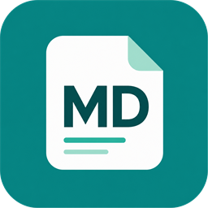
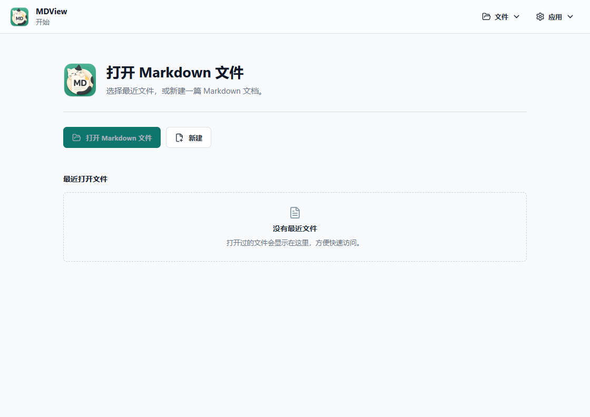

<p align="center">
  
</p>

<h1 align="center">MDView</h1>

<p align="center">
  A lightweight cross-platform Markdown viewer and editor for Windows and macOS.
  <br />
  适用于 Windows 和 macOS 的轻量级 Markdown 查看与编辑工具。
</p>

<p align="center">
  <a href="#中文">中文</a>
  ·
  <a href="#english">English</a>
</p>

<p align="center">
  <strong>Version / 版本：</strong>1.6.0
  ·
  <strong>Author / 作者：</strong>Sunky
  ·
  <a href="https://www.sunky.net">www.sunky.net</a>
</p>



---

## 中文

MDView 是一款轻量、清爽的跨平台 Markdown 桌面应用，适合快速打开、阅读和简单编辑 `.md` / `.markdown` 文件。应用采用预览优先的界面设计，并提供源码编辑、文档目录、格式工具、文件关联和导出等常用能力。

目前已提供 **Windows** 和 **macOS** 版本，可前往 [GitHub Releases](https://github.com/isunky/MDView/releases) 获取。

### 主要功能

- **三种查看模式**：支持预览、编辑和分屏模式，可按不同场景快速切换。
- **Markdown 实时预览**：支持标题、列表、引用、链接、图片、表格、任务列表和代码高亮。
- **内嵌 HTML 渲染**：可渲染 Markdown 中混合使用的常见 HTML 标签。
- **本地资源支持**：正确显示相对路径、绝对路径和 `file://` 路径引用的本地图片。
- **Markdown 文档跳转**：点击相对路径 Markdown 链接，可直接打开目标文件并跳转到指定标题。
- **文档目录导航**：自动提取 `H1` 至 `H3` 标题并支持点击跳转；目录可关闭、重新打开和拖动调整宽度。
- **快捷格式工具栏**：快速插入标题、粗体、斜体、行内代码、链接、图片、引用、列表和任务列表。
- **高效编辑操作**：支持常用键盘快捷键、`Tab` 缩进、`Shift+Tab` 反向缩进以及列表自动续写。
- **Markdown 语法参考**：内置常用语法速查窗口，编辑时可随时打开。
- **文件操作**：支持新建、打开、保存、另存为和最近文件列表。
- **导出功能**：支持导出为独立 HTML 文件，并通过系统打印能力导出 PDF。
- **文件关联**：安装后可关联 `.md` 和 `.markdown` 文件，直接从系统文件管理器打开。
- **编辑状态提示**：清晰显示已保存和未保存状态，降低内容丢失风险。
- **中英文界面**：根据系统语言自动选择中文或英文，并支持在应用内切换。
- **跨平台桌面应用**：基于 Tauri 2 构建，已支持 Windows 和 macOS。

### 常用快捷键

| 操作 | Windows | macOS |
| --- | --- | --- |
| 粗体 | `Ctrl+B` | `Command+B` |
| 斜体 | `Ctrl+I` | `Command+I` |
| 插入链接 | `Ctrl+K` | `Command+K` |
| 有序列表 | `Ctrl+Shift+7` | `Command+Shift+7` |
| 无序列表 | `Ctrl+Shift+8` | `Command+Shift+8` |
| 缩进 / 反向缩进 | `Tab` / `Shift+Tab` | `Tab` / `Shift+Tab` |

### 技术栈

| 层级 | 技术 |
| --- | --- |
| 桌面外壳 | Tauri 2 |
| 前端 | React 19、TypeScript、Vite |
| Markdown | react-markdown、remark-gfm、rehype-raw、rehype-highlight、highlight.js |
| 测试与质量 | Vitest、Testing Library、Playwright、ESLint、GitHub Actions |

### 快速开始

安装依赖：

```bash
npm install
```

运行 Web 开发预览：

```bash
npm run dev
```

运行桌面开发模式：

```bash
npm run desktop:dev
```

运行测试和构建检查：

```bash
npm run test
npm run lint
npm run build
npm run test:e2e
```

同步应用版本号：

```bash
npm run version:sync -- 1.4.1
```

### Windows 打包

Windows 桌面构建需要 Rust/Cargo、Visual Studio Build Tools 和 C++ 构建工具。

生成默认 Tauri 安装包：

```bash
npm run desktop:build
```

仅生成 MSI：

```bash
npm run desktop:build -- --bundles msi
```

MSI 默认输出目录：

```text
src-tauri/target/release/bundle/msi/
```

### macOS 打包

macOS 安装包需要在 macOS 或 macOS CI Runner 上构建，并提前安装 Node.js、Rust/Cargo 和 Xcode Command Line Tools。

生成 macOS 安装包：

```bash
npm run desktop:build
```

仅生成 DMG：

```bash
npm run desktop:build -- --bundles dmg
```

默认输出目录：

```text
src-tauri/target/release/bundle/macos/
src-tauri/target/release/bundle/dmg/
```

### CI、发布与签名

仓库包含 GitHub Actions 工作流：

- PR 和主分支推送会自动执行单元测试、lint、前端构建和 Web E2E 测试。
- CI 工作流也支持在 GitHub Actions 页面手动触发。
- CI 会并行构建 Windows MSI 和兼容 Apple Silicon、Intel Mac 的 Universal DMG artifact。
- 在 GitHub Actions 的 `Release` 工作流中选择 `patch`、`minor` 或 `major`，即可自动生成下一个版本号。
- 发布流程会同步项目版本文件、提交版本变更、构建两个平台的安装包，并在构建成功后创建标准 Tag 和 GitHub Release。
- 例如当前版本为 `1.5.0` 时，`patch` 生成 `1.5.1`，`minor` 生成 `1.6.0`，`major` 生成 `2.0.0`。
- 也可以手动推送与项目版本一致的 `v1.2.3` 格式 Tag 来触发发布。
- macOS CI 安装包默认未进行 Apple Developer 签名和公证。

自动版本提交需要仓库允许 GitHub Actions 写入内容。如果默认分支启用了分支保护，请允许 `github-actions[bot]` 写入，或为发布流程配置对应规则。

Windows 安装包支持可选签名。需要在 CI 中签名时，请配置：

- `WINDOWS_CERTIFICATE_BASE64`
- `WINDOWS_CERTIFICATE_PASSWORD`
- `WINDOWS_CERTIFICATE_THUMBPRINT`

未配置证书时，工作流仍会生成未签名 MSI。

### 图标资源

- 前端图标：`src/assets/app-icon.png`
- Tauri 源图：`src-tauri/app-icon.png`
- 平台图标集：`src-tauri/icons/`

重新生成平台图标：

```bash
npx tauri icon src-tauri/app-icon.png
```

### 项目信息

| 项目 | 内容 |
| --- | --- |
| 应用名称 | MDView |
| 当前版本 | 1.6.0 |
| 支持平台 | Windows、macOS |
| 作者 | Sunky |
| 网站 | [www.sunky.net](https://www.sunky.net) |
| 许可证 | GPL-3.0 |

---

## English

MDView is a lightweight, focused cross-platform desktop app for opening, reading, and making simple edits to `.md` and `.markdown` files. It uses a preview-first interface while keeping source editing, document navigation, formatting tools, file associations, and export features close at hand.

Current releases are available for **Windows** and **macOS**. Download them from [GitHub Releases](https://github.com/isunky/MDView/releases).
Windows releases include both an MSI installer and a portable ZIP package.

### Features

- **Three view modes**: switch between Preview, Edit, and Split modes.
- **Live Markdown preview**: renders headings, lists, blockquotes, links, images, tables, task lists, highlighted code blocks, and Mermaid diagrams.
- **Inline HTML rendering**: renders common HTML embedded directly in Markdown documents.
- **Local resource support**: loads local images referenced by relative, absolute, and `file://` paths.
- **Markdown document links**: opens linked local Markdown files and jumps to the requested heading.
- **Document outline**: extracts `H1` through `H3` headings with click-to-jump navigation; the outline can be collapsed, reopened, and resized.
- **Formatting toolbar**: quickly inserts headings, bold, italic, inline code, links, images, quotes, lists, and task lists.
- **Efficient editing**: provides common keyboard shortcuts, `Tab` indentation, `Shift+Tab` outdentation, and automatic list continuation.
- **Markdown syntax reference**: includes a built-in quick reference for commonly used Markdown syntax.
- **File workflows**: supports new, open, save, save as, and recent files.
- **Export**: exports self-contained HTML files and creates PDFs through the system print workflow.
- **File associations**: associates `.md` and `.markdown` files so they can be opened directly from the system file manager.
- **Clear document state**: shows saved and unsaved status to reduce accidental data loss.
- **Bilingual interface**: detects Chinese or English from the system language and allows switching inside the app.
- **Cross-platform desktop app**: built with Tauri 2 and available for Windows and macOS.

### Keyboard Shortcuts

| Action | Windows | macOS |
| --- | --- | --- |
| Bold | `Ctrl+B` | `Command+B` |
| Italic | `Ctrl+I` | `Command+I` |
| Insert link | `Ctrl+K` | `Command+K` |
| Ordered list | `Ctrl+Shift+7` | `Command+Shift+7` |
| Unordered list | `Ctrl+Shift+8` | `Command+Shift+8` |
| Indent / outdent | `Tab` / `Shift+Tab` | `Tab` / `Shift+Tab` |

### Tech Stack

| Layer | Technology |
| --- | --- |
| Desktop shell | Tauri 2 |
| Frontend | React 19, TypeScript, Vite |
| Markdown | react-markdown, remark-gfm, rehype-raw, rehype-highlight, highlight.js |
| Testing and quality | Vitest, Testing Library, Playwright, ESLint, GitHub Actions |

### Getting Started

Install dependencies:

```bash
npm install
```

Run the web development preview:

```bash
npm run dev
```

Run the desktop app in development mode:

```bash
npm run desktop:dev
```

Run tests and build checks:

```bash
npm run test
npm run lint
npm run build
npm run test:e2e
```

Synchronize the app version:

```bash
npm run version:sync -- 1.4.1
```

### Windows Packaging

Windows desktop builds require Rust/Cargo, Visual Studio Build Tools, and the C++ toolchain.

Build the default Tauri bundles:

```bash
npm run desktop:build
```

Build MSI only:

```bash
npm run desktop:build -- --bundles msi
```

Build the Windows portable ZIP after the desktop release build:

```bash
npm run portable:windows
```

Default MSI output directory:

```text
src-tauri/target/release/bundle/msi/
```

Default portable ZIP output directory:

```text
src-tauri/target/release/bundle/portable/
```

The portable ZIP is extract-and-run only. It does not install MDView or register `.md` / `.markdown` file associations.

### macOS Packaging

macOS installers must be built on macOS or a macOS CI runner with Node.js, Rust/Cargo, and Xcode Command Line Tools installed.

Build the macOS bundles:

```bash
npm run desktop:build
```

Build DMG only:

```bash
npm run desktop:build -- --bundles dmg
```

Default output directories:

```text
src-tauri/target/release/bundle/macos/
src-tauri/target/release/bundle/dmg/
```

### CI, Release, and Signing

The repository includes GitHub Actions workflows:

- Pull requests and main branch pushes run unit tests, lint, frontend builds, and Web E2E tests.
- The CI workflow can also be started manually from the GitHub Actions page.
- CI builds a Windows MSI, a Windows portable ZIP, and a Universal DMG for both Apple Silicon and Intel Macs in parallel.
- Run the `Release` workflow with a `patch`, `minor`, or `major` increment to generate the next version automatically.
- The release workflow synchronizes version files, commits the version update, builds the Windows MSI, Windows portable ZIP, and macOS DMG, then creates a SemVer Tag and GitHub Release after all builds succeed.
- From `1.5.0`, `patch` creates `1.5.1`, `minor` creates `1.6.0`, and `major` creates `2.0.0`.
- A matching `v1.2.3` tag can also be pushed manually to trigger a release.
- macOS CI artifacts are unsigned and not notarized by default.

Automatic version commits require GitHub Actions content write access. If the default branch is protected, allow `github-actions[bot]` to write or configure an appropriate release rule.

Windows installers support optional signing. Configure these secrets to sign MSI builds in CI:

- `WINDOWS_CERTIFICATE_BASE64`
- `WINDOWS_CERTIFICATE_PASSWORD`
- `WINDOWS_CERTIFICATE_THUMBPRINT`

Without certificate secrets, the workflow still produces unsigned MSI builds.

### Icon Assets

- Frontend icon: `src/assets/app-icon.png`
- Tauri source icon: `src-tauri/app-icon.png`
- Platform icon set: `src-tauri/icons/`

Regenerate platform icons:

```bash
npx tauri icon src-tauri/app-icon.png
```

### Project Info

| Item | Value |
| --- | --- |
| App name | MDView |
| Current version | 1.6.0 |
| Supported platforms | Windows, macOS |
| Author | Sunky |
| Website | [www.sunky.net](https://www.sunky.net) |
| License | Apache-2.0 |
