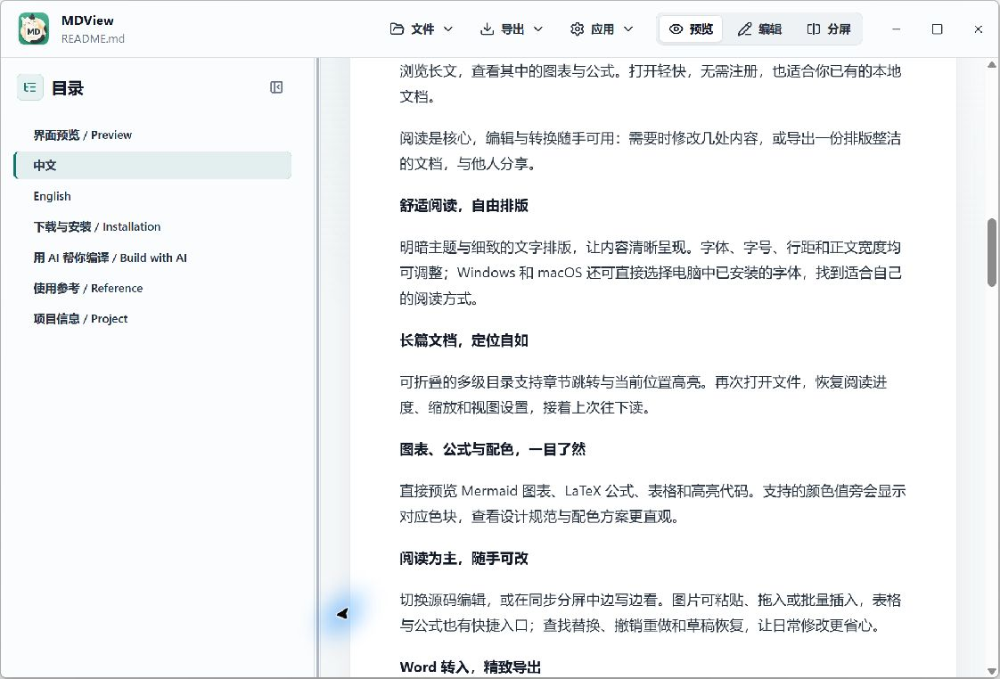
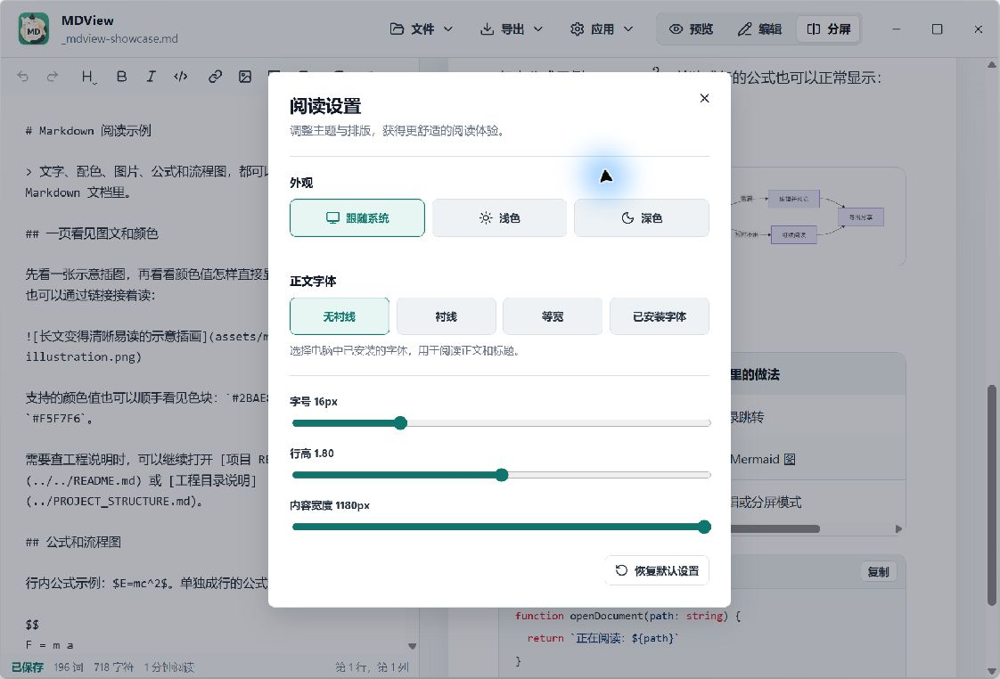
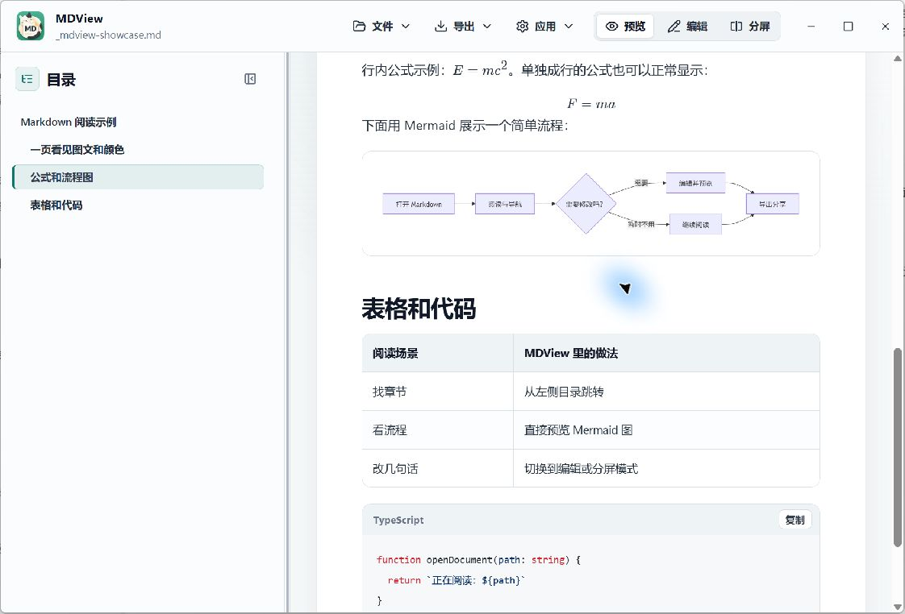
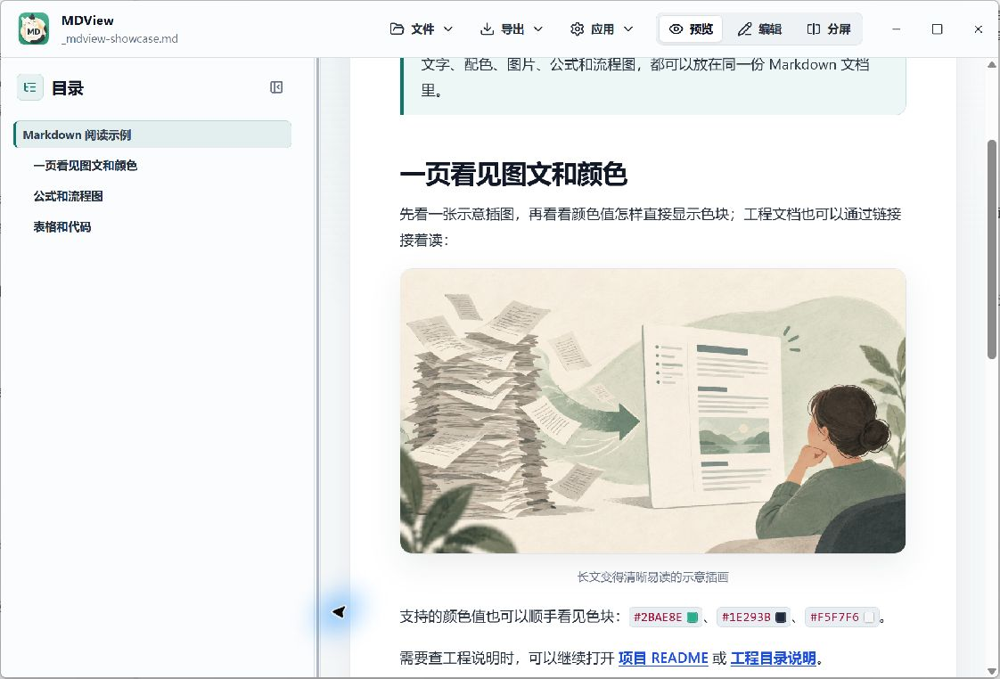
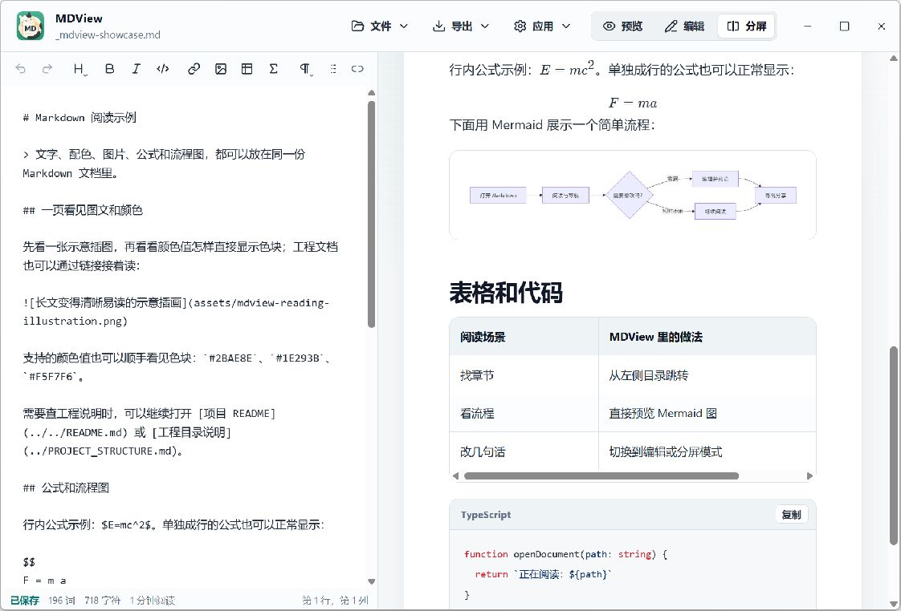
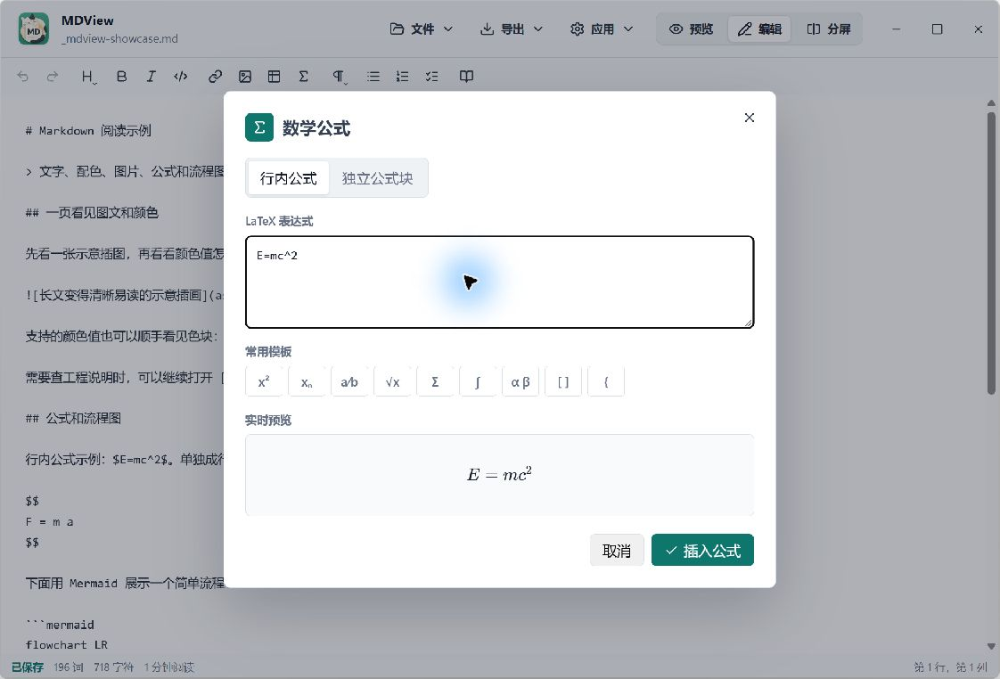
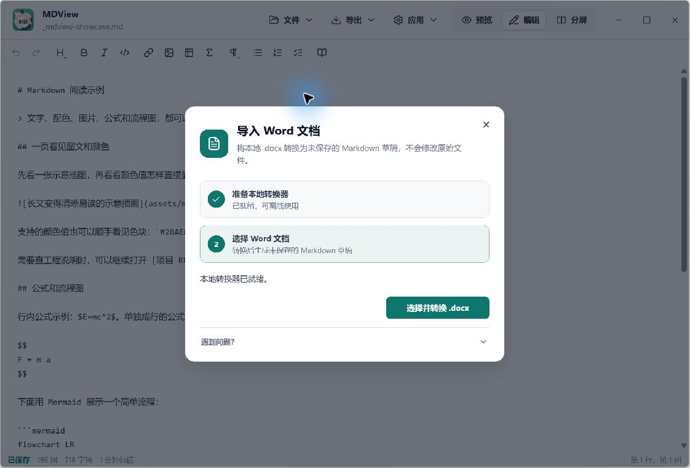
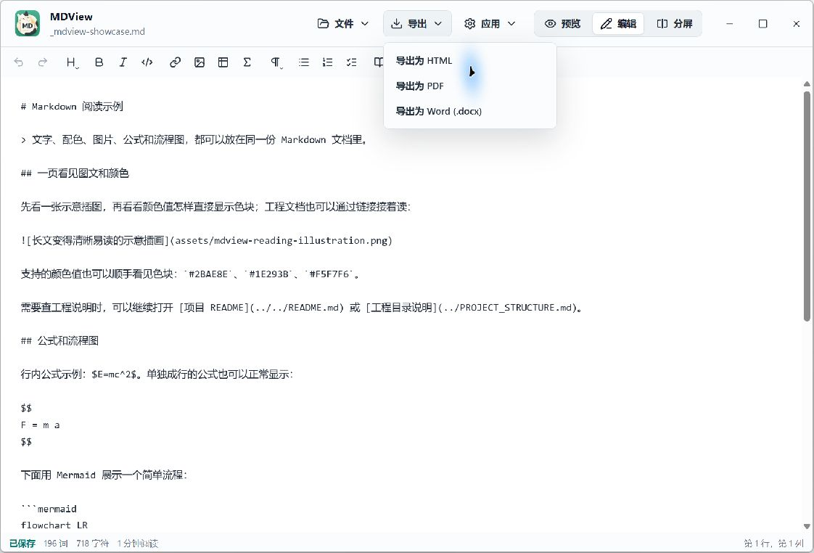

# 给 Markdown 一个好读的家：我为什么做了 MDView

<!-- 开篇为示意插图；下文标注“实机截图”的配图均由 Windows 版 MDView 现场拍摄。 -->

有时候我会把一份挺长的 AI 生成方案存成 Markdown。内容写得很完整，打开以后却是一屏标题符号、代码围栏和表格分隔线；想找某一段，还得一路滚轮往下翻。

Markdown 很适合写内容，但“写完以后怎么舒服地读”，常常被忽略。我做 MDView，就是想把这一步照顾好：打开一份 `.md`，先读清楚；需要时改几处；最后再把内容带走。

打开 MDView 后，可以从欢迎页新建文档、打开电脑里的 Markdown 文件，或者继续最近读过的文件。我希望它更像拿起一本放在手边的小册子：打开就能接着看。AI 生成的方案、项目里的说明文档、自己攒下的笔记都可以；文件本身还是普通的 Markdown，保存在你熟悉的位置。

*示意插图：把长文整理成更轻松的阅读体验。*

## 先把长文读顺

MDView 打开 Markdown 后，可以直接看排版好的内容。遇到长文，左侧目录就是一张小地图：点一下章节标题就能跳过去，读到哪一节也有位置提示。比起记住“刚才那个部分大概在屏幕往下三十页”，这通常省心得多。

正文怎么摆，也可以按自己的习惯调。字体、字号、行距和阅读宽度都能调整，还能切换明暗主题。Windows 和 macOS 上可以选系统里已有的字体。下次再打开文档时，MDView 也能接着上次的阅读位置和视图设置，让你不必从第一页重新找状态。

*实机截图：目录与正文在同一窗口中，点章节就能接着读。*

我想让阅读体验尽量安静：文档是主角，常用操作放在顺手的位置。你也可以先把目录收起来，多留一点空间给正文；需要快速浏览结构时，再把目录展开。

有些人喜欢一行写得长一点，有些人看长段落更喜欢窄一些的版心；有人习惯大字号，也有人更在意一页能多放几段。阅读设置就是给这些小偏好留的位置。换主题、调宽度、微调行距，不用改动 Markdown 文件里的任何内容。

*实机截图：阅读外观和版面细节，都能按自己的习惯调整。*

## 表格、代码、图表和公式，直接看结果

Markdown 不只有标题和段落。MDView 也会把常见表格、任务列表和代码块排版好，代码按语言显示颜色；文档里有 Mermaid 图表或 LaTeX 公式，也可以直接看到渲染结果。比如行内公式 `E=mc^2`，或单独成行的公式，都不用先在脑海里“预览”一遍。

我自己读项目说明时，也常遇到配色值、相对路径图片和文档间链接。MDView 会在支持的颜色值旁显示色块，本地图片可以跟着 Markdown 一起预览，文档里的网页链接仍交给默认浏览器打开；本地 Markdown 链接则可以在应用里接着看。

这些小细节的用处是让内容“看起来像它本来想表达的样子”。流程图不再是一段要靠猜的代码，配色方案旁边也不必自己拿色卡对照；遇到技术说明里的代码，就按着语法颜色扫一眼，通常比盯着一整块纯文本轻松。

*实机截图：公式、流程图、表格和代码都能在预览里直接看结果。*

*实机截图：本地插图和链接跟着文档一起预览，支持的颜色值也会显示色块。*

## 想改几句，不必换个地方重来

如果读到一半发现标题要改、表格要补一行，切到编辑模式就能直接修改 Markdown 源文。想一边改、一边看最终效果，也可以打开分屏：左边写，右边看，滚动位置会跟着同步。对我来说，这个模式很适合做最后一轮小修——既看得到 `**加粗**` 这样的写法，也能马上确认呈现出来的样子。

常见操作有工具栏入口和快捷键：查找、替换、撤销、重做，插入链接、表格或公式，都不需要背一长串语法。图片也可以粘贴或拖进编辑器。临时关窗或者遇到意外时，未保存草稿恢复能帮你接回刚才的修改。

比如我只是想把某一段加粗、补一个小标题，直接选中后点工具栏就行；写列表时可以用 Tab 调整缩进，Shift+Tab 再退回来。查找适合定位人名、术语或待改的字段，撤销和重做则让我可以放心试一下，不用每次改动前都先复制一份备用稿。

*实机截图：左边看源码，右边看效果，窗口上方还能开启同步滚动。*

*实机截图：输入公式时，可以先看排版效果再决定是否插入。*

## 从 Word 转进来，再把整理好的内容带出去

手头有一份 Word 文档，也可以导入为 Markdown 草稿；整理完以后，保存成 `.md` 继续维护。这个转换在本机完成。第一次使用时，需要准备 Python 和转换组件，下载组件时需要联网；这一步不是每天都要重复做。

整理好的内容可以导出为 Word，也可以导出成独立 HTML；需要 PDF 时，用系统打印功能就能生成。这样，Markdown 可以继续留作方便修改的原稿，Word、HTML 或 PDF 则按分享和交付场景来选。

我常把 Markdown 当作“方便维护的原稿”：内容结构在 `.md` 里一直清清楚楚，到了要发给同事或交作业的时候，再导出大家更熟悉的格式。导出的 HTML 是独立文件，拿到另一台电脑上也能打开看，不需要对方先装 MDView。

*实机截图：Word 在本机转换成 Markdown 草稿，原文件保持不变。*

*实机截图：看完、改完，再按分享对象选择导出格式。*

## 我会在什么时候用 MDView？

不同工具各有顺手的地方。Typora 的官方介绍强调 Markdown 写作和实时预览；VS Code 的官方指南则列出 Markdown 预览、大纲和编辑器同步能力。结合这些重点，我会这样按场景来挑：

我把 MDView 的重心放在“读”：本地打开一份文档，先用舒服的排版读完，再通过目录定位、快速修改或导出把事情收尾。如果你已经在 VS Code 里工作，继续在那里写当然很方便；如果一份 Markdown 更像要读的文章或说明，MDView 就能给它一个安静的阅读位置。

- **Typora**：以 Markdown 写作为主，喜欢边写边看实时预览时，可以看看它。
- **VS Code**：在代码项目中维护 Markdown，并想把并排预览、大纲和开发工具放在一起时，它很顺手。
- **MDView**：如果主要任务是阅读本地 Markdown，偶尔编辑，再整理成适合分享的格式，这就是我希望它帮上忙的地方。

更多信息可以看 [Typora 官方介绍](https://typora.io/)和 [VS Code Markdown 指南](https://code.visualstudio.com/Docs/languages/markdown)。

## 让下一份 Markdown 更好读一点

MDView 免费、没有广告，以本地文档为中心，也不需要注册账号。我希望当你收到一份 AI 生成的方案、项目说明，或者朋友发来的 Markdown 时，能少花点力气在“怎么打开、怎么找”，多把注意力放在内容本身。AI 写的也好，自己写的也好，打开后都先是一份普通 Markdown 文档；MDView 想做的，是让它读起来更舒服。

如果这正好是你想要的，可以到 [MDView Releases](https://github.com/isunky/MDView/releases/latest) 看看适合自己的版本。把一份 `.md` 打开，读读看就知道了。
